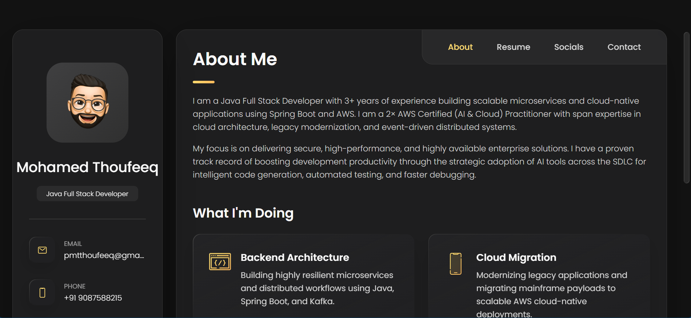

# 🚀 Personal Portfolio Website

> A sleek, responsive, and modern personal portfolio website built with HTML, CSS, and Vanilla JavaScript.



Welcome to my personal portfolio repository! This project serves as my digital resume, showcasing my experience as a Java Full Stack Developer, my technical skills, educational background, and social profiles. It is designed with a beautiful dark theme, smooth transitions, and a highly organized UI.

---

## ✨ Features

- **📱 Fully Responsive:** Beautifully adapts to all device sizes (mobile, tablet, and desktop).
- **🎨 Modern Dark UI:** A visually striking dark theme with elegant gold/yellow accent colors.
- **🗂️ Categorized Tech Stack:** A clean, badge-style layout to display programming languages, frameworks, and tools.
- **⚡ Lightweight & Fast:** Built purely with HTML5, CSS3, and Vanilla JavaScript—no heavy frameworks required.
- **🧭 Smooth Navigation:** Single-page application feel with JavaScript-powered tab navigation.
- **📬 Contact Form:** Integrated UI for a contact form and a Google Maps embed.

---

## 🛠️ Tech Stack Built With

- **HTML5** - Semantic structure and content routing.
- **CSS3** - Custom properties (variables), Flexbox, CSS Grid, and animations.
- **Vanilla JavaScript** - DOM manipulation, event listeners, and dynamic tab switching.
- **[IonIcons](https://ionic.io/ionicons)** - Premium open-source icons.

---

## 🚀 How to Clone and Reuse

Want to use this portfolio structure for yourself? You can easily clone this repository and swap out the data for yours!

### 1. Clone the Repository

Open your terminal and run the following command:

```bash
git clone https://github.com/MohamedThoufeeq/portfolio.git
```

### 2. Navigate to the Directory

```bash
cd portfolio
```

### 3. Open in your Browser

You don't need a build step, a compiler, or a local server to view this project! Simply open the `index.html` file in your preferred web browser.

```bash
# On Mac
open index.html

# On Windows
start index.html
```

---

## ✏️ Customization Guide

To personalize this portfolio, open `index.html` in your favorite code editor and modify the following sections:

1.  **Personal Info:** Update the `<aside class="sidebar">` with your name, job title, email, phone number, and location.
2.  **About Me:** Edit the text inside the `<article class="about">` tag to reflect your professional summary.
3.  **Resume:** Update the `<section class="timeline">` with your own Experience and Education history.
4.  **Tech Stack:** Swap out the skill names and `<ion-icon>` tags in the "Tech Stack" section to match your expertise.
5.  **Images:** Replace the dummy images in the `./assets/images/` folder with your own avatar and project screenshots.

---

## 👏 Credits & Acknowledgements

The original UI design, CSS architecture, and base template for this project were created by **[codewithsadee](https://github.com/codewithsadee/vcard-personal-portfolio)**.

Massive thanks to them for providing such a stunning and well-structured open-source vCard template. I have heavily customized the content, skill layout, and HTML structure to fit my professional background and technical requirements, but the core aesthetic brilliance belongs to their original work.

---

## 📄 License

This project is open-source and available under the [MIT License](LICENSE).
